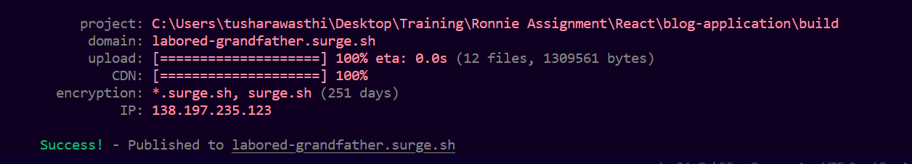

# React Blog Application

This is a simple blog application built using React, Redux.

## Features

* Fetches All Blogs.
* View a blogpost.
* Edit a blog.
* Delete a blog.
* Like/Unlike a blog.
* Create a new blog.

## How to run this blog app

1. Extract the Zip File.
2. Open Terminal and navigate to `/blog-application` folder.
3. Install all the dependencies using `npm install` command.
4. Run the application using `npm start` command.
5. The _development server_ will be started.
6. Open the website [localhost:3000](localhost:3000) (**localhost** at port **3000**). We can see the application.

## Deployment on surge

I have successfully deployed the application on surge.

Url:- [labored-grandfather.surge.sh](http://labored-grandfather.surge.sh/)